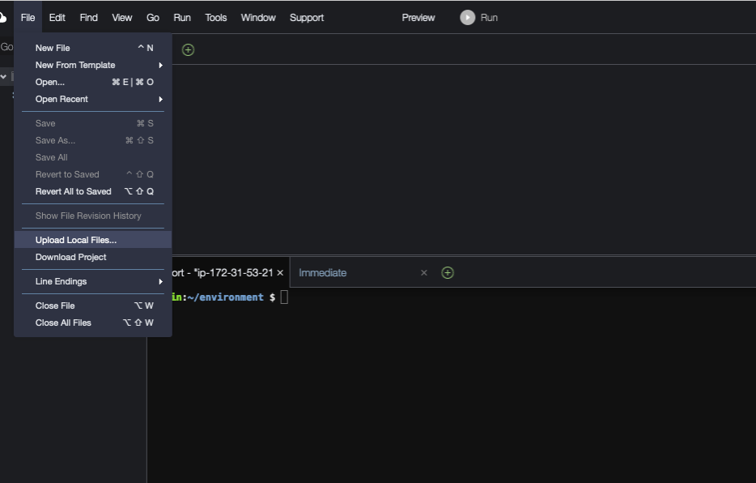

# AWS Setup Guide for Bedrock Agent with Streamlit

## Introduction
This guide details the setup process for Bedrock agent on AWS, including S3 buckets, a knowledge base, and a Lambda function. The agent is designed for creating and managing company portfolios based on specific criteria. We will use the Streamlit framework for the user interface.

## Prerequisites
- An active AWS Account.
- Familiarity with AWS services like S3, Lambda, and OpenSearch Serverless.

## Configuration and Setup
### Step 1: Creating S3 Buckets
- **Domain Data Bucket**: Set up an S3 bucket for domain data (.txt, .csv, .pdf). Add the following .pdf report files to this S3 bucket

- **Artifacts Bucket**: Set up another S3 bucket for storing artifacts and the API schema. Add the following API schema file to this s3 bucket:

### Step 2: Knowledge Base Setup in Bedrock Agent
- Sync the domain data S3 bucket with the Bedrock agent.

- Select default OpenSearch Serverless as the vector store.
 

### Step 3: Lambda Function Configuration
- Develop a Lambda function (Python 11) for the Bedrock agent's action group. Copy the provided code from GitHub here into your Lambda function: 

- Make sure that the Bedrock agent role can invoke the Lambda function.
- Apply a resource policy to the Lambda to grant Bedrock agent access. Here is an example of the resource policy:  

### Step 4: Bedrock Agent Creation
- Create agent with high level instructions on what the agent is used for. Example: “This Agent is used to create Portfolios of companies based on the number of companies, industry, and portfolio name input” (when creating the agent, select the Lambda function created prior. Make sure to include the lambda code provided. Also, select the s3 bucket that contains the artifacts, which should include the API schema provided)
 

### Step 5: Integrating Knowledge Base with Bedrock Agent
- When integrating the KB with the agent, you will need to provide basic instructions on how to handle the knowledge base. For example, you could use: “knowledge base for answering queries to prompts. After every response, ask if anything else is needed.”
 

### Step 6: Create an alias
-Create an alias (new version), and choose a name of your liking. 
 

## Testing the Setup
### Testing the Knowledge Base
- Use the Bedrock console to test the knowledge base after its creation.
- Test Prompts:
  1. "Give me a summary of financial market developments and open market operations in January 2023."
  2. "What is the SEC's view on current economic conditions for September 2023?"
  3. "Can you provide information about inflation or rising prices?"
  4. "What can you tell me about the Staff Review of the Economic & Financial Situation?"

### Testing the Bedrock Agent
- After connecting the agent to the knowledge base, test it using the Bedrock console.
- Test Prompts for Action Groups:
  1. "Create a portfolio with top 3 company profit earners in real estate."
  2. "Create another portfolio of top 3 profit earners in technology."
  3. "Provide more details on these companies."
  4. "Help me create a new investment portfolio of companies."
  5. "Do company research on TechNova Inc."

## Setting Up and Running the Streamlit App
1. **Obtain the Streamlit App ZIP File**: Ensure you have the ZIP file containing the Streamlit app.
2. **Upload to Cloud9**:
   - In your Cloud9 environment, upload the ZIP file.

3. **Unzip the File**:
   - Use the command `unzip <filename>.zip` to extract the contents.
4. **Navigate to Streamlit_App Folder**:
   - Change to the directory containing the Streamlit app, which is “/environment/bedrock-agents-streamlit-main/Streamlit_App/app.py”
5. **Update Configuration**:
   - Open the `InvokeAgent.py` file.
   - Update the `agentId` and `agentAliasId` variables with the appropriate values.

