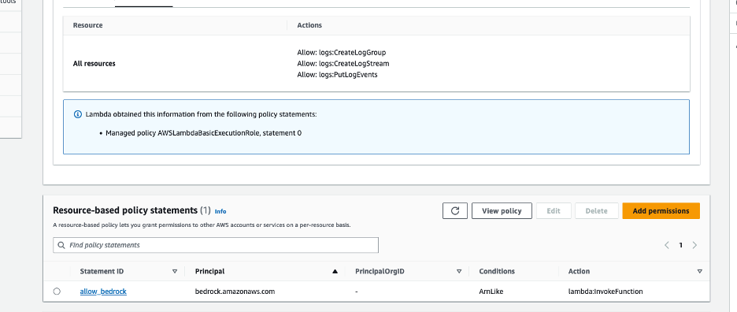
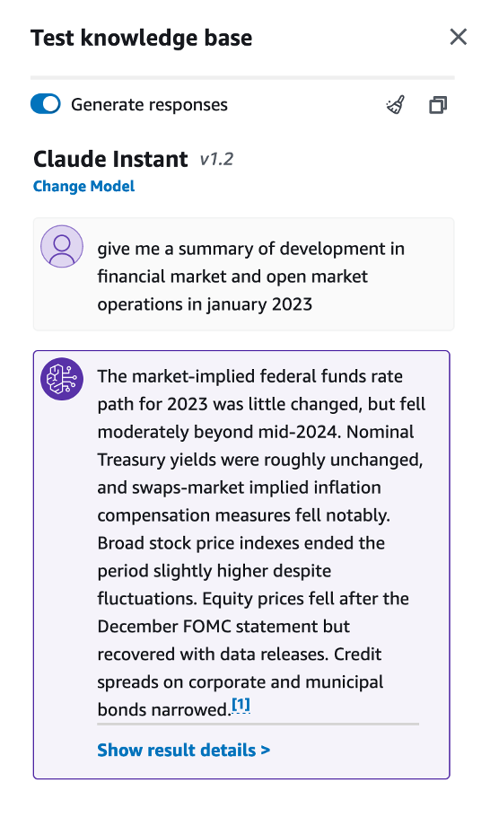

# AWS Setup Guide for Bedrock Agent with Streamlit

## Introduction
This guide details the setup process for an Amazon Bedrock agent on AWS, which will include setting up S3 buckets, a knowledge base, an action group, and a Lambda function. The agent is designed for dynamically creating an investment company portfolio based on specific parameters, and providing a Q&A capability to domain data. We will use the Streamlit framework for the user interface.

## Prerequisites
- An active AWS Account.
- Familiarity with AWS services like Amazon Bedrock, S3, Lambda, and Cloud9.

## Configuration and Setup

### Step 1: Creating S3 Buckets
- **Domain Data Bucket**: Create an S3 bucket to store the domain data. For example, call the S3 bucket "knowledgebase-bedrock-agent-alias". We will use the default settings. 

After creation, add the .pdf files located [here](https://github.com/jossai87/bedrock-agents-streamlit/tree/main/s3Docs) to the s3 bucket.
(These files are the Federal Open Market Committee documents describing monetary policy decisions made at FOMC meetings. The documents include discussion of economic conditions, policy directives to the Federal Reserve Bank of New York for open market operations, and votes on target ranges for the federal funds rate.). Once uploaded, please select one of the documents to open and review the content.

- **Artifacts Bucket**: Create another S3 bucket to store artifacts. For example, call it "artifacts-bedrock-agent-creator-alias". You will need to download, then add the API schema file to this S3 bucket. This .json file can be found [here](https://github.com/jossai87/bedrock-agents-streamlit/blob/main/WorkingSchema.json). 
(The provided schema is an OpenAPI specification for the "PortfolioCreator-471 API," which outlines the structure and capabilities of a service designed for stock portfolio creation and company financial research. It defines two primary endpoints, "/companyResearch" and "/createPortfolio," detailing how to interact with the API, the required parameters, and the expected responses.) Once uploaded, please select and open the .json document to review the content.

 

### Step 2: Knowledge Base Setup in Bedrock Agent
- Navigate to the Amazon Bedrock console, then create a knowledge base. You can use the default name, or enter in your own. Then, select "Next" at the bottom right of the screen. 

- Sync S3 bucket "knowledgebase-bedrock-agent-alias" to this knowledge base.

- Select the default option OpenSearch Serverless as the vector store.
 

- On the next screen, review your work, then select "Create Knowledge Base" 
(Creating the knowledge base may take a few minutes. You can continue to the next step in the meantime.)

### Step 3: Lambda Function Configuration
- Create a Lambda function (Python 3.11) for the Bedrock agent's action group. We will call this Lambda function "PortfolioCreator-actions". 

-Copy the provided code from the ["WorkingLambda.py"](https://github.com/jossai87/bedrock-agents-streamlit/blob/main/WorkingLambda.py) file into your Lambda function. After, select the deploy button in the tab section in the Lambda console. (Make sure that the IAM role associated with the Bedrock agent can invoke the Lambda function)

- Next, apply a resource policy to the Lambda to grant Bedrock agent access. To do this, we will switch the top tab from “code” to “configuration” and the side tab to “Permissions”. Then, scroll to the “Resource-based policy statements” section and click the “Add permissions” button.

- Here is an example of the resource policy: 
(be sure to use the correct Bedrock agent Source ARN for your Lambda resource policy):

### Step 4: Setup Bedrock Agent and Action Group 
- Navigate to the Bedrock console, go to the toggle on the left, and under “Orchestration” select Agents. Select “Create Agent”.

- On the next screen, provide an agent name, and leave the other options as default, then select “Next”

- Select the Anthropic: Claude V2 model. Add instructions on what the agent is used for. For example, use the following: “Your job is to create Portfolios of companies based on the number of companies, and industry. You are also used to do company research using the action groups. You will use the Federal Open Market Committee documents provided in the knowledge base to answer questions.”

When creating the agent, select Lambda function "PortfolioCreator-actions". Make sure to include the lambda code provided. Next, select the schema file WorkingSchema.json from the s3 bucket "artifacts-bedrock-agent-creator-alias", which should include the API schema.

### Step 5: Setup Knowledge Base with Bedrock Agent

- Select the agent created in the previous step. Scroll down and select “Working draft”, then the “Add” button under Knowledge bases.

- When integrating the KB with the agent, you will need to provide basic instructions on how to handle the knowledge base. For example, use the following: “knowledge base for answering queries to prompts. After every response, ask if anything else is needed.”
 

### Step 6: Create an alias
-Create an alias (new version), and choose a name of your liking. 
 

- Next, navigate to the "Agent Overview" settings for the agent created by selecting "Agents" under the Orchestration dropdown menu on the left of the screen, then select the agent. Copy the Agent ARN, then add this ARN to the resource policy of Lambda function “PortfolioCreator-actions” previously created in step 3. 

## Testing the Setup
### Testing the Knowledge Base
- While in the Bedrock console, select “Knowledge base” under the Orchestration tab, then the KB you created. Scroll down to the Data source section, and make sure to select the “Sync” button.

- You will see a user interface on the right where you will need to select a model. Choose the Anthropic Claude V2 model, then select “Apply”.

- You should now have the ability to enter prompts in the user interface provided.

- Test Prompts:
  1. "Give me a summary of financial market developments and open market operations in January 2023."
  2. "What is the SEC's view on current economic conditions for September 2023?"
  3. "Can you provide information about inflation or rising prices?"
  4. "What can you tell me about the Staff Review of the Economic & Financial Situation?"

### Testing the Bedrock Agent
- While in the Bedrock console, select “Agents” under the Orchestration tab, then the agent you created. You should be able to enter prompts in the user interface provided to test your knowledge base and action groups from the agent.

- Tests knowledge base:
    1. "Give me a summary of development in financial market and open market operations in january 2023"
    2. "What is the SEC participants view on current economic conditions and economic outlook for september 2023"
    3. "Can you provide any other important information I should know about inflation, or rising prices?"
    4. "What can you tell me about the Staff Review of the Economic & financial Situation?"

- Test prompts for action groups:
    1. "Create a portfolio with top 3 company profit earners in real estate."
    2. "Create another portfolio of top 3 profit earners in technology."
    3. "Provide more details on these companies."
    4. "Help me create a new investment portfolio of companies."
    5. "Do company research on TechNova Inc."

## Setting Up and Running the Streamlit App
1. **Obtain the Streamlit App ZIP File**: Ensure you have the ZIP file containing the Streamlit app, which you can download from [here](https://github.com/jossai87/bedrock-agents-streamlit/archive/refs/heads/main.zip).

2. **Upload to Cloud9**:
   - In your Cloud9 environment, upload the ZIP file.

3. **Unzip the File**:
   - Use the command `unzip <filename>.zip` to extract the contents.
4. **Navigate to Streamlit_App Folder**:
   - Change to the directory containing the Streamlit app, which is “/environment/bedrock-agents-streamlit-main/Streamlit_App”
5. **Update Configuration**:
   - Open the `InvokeAgent.py` file.
   - Update the `agentId` and `agentAliasId` variables with the appropriate values, then save it.

6. **Install Streamlit** (if not already installed):
   - Run `pip install streamlit`. Additionally, make sure boto3, and pandas dependencies are installed.

7. **Run the Streamlit App**:
   - Execute the command `streamlit run app.py --server.address=0.0.0.0 --server.port=8080`.
   - Streamlit will start the app, and you can view it by selecting "Preview" within the Cloud9 IDE at the top, then "Preview Running Application"

Optionally, you can review the trace events in the left toggle of the screen.

Enjoy!

